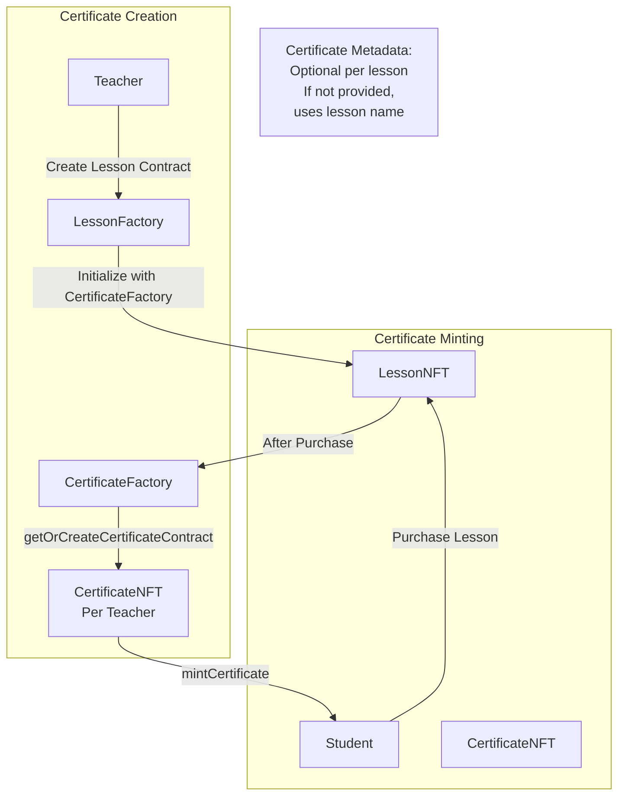
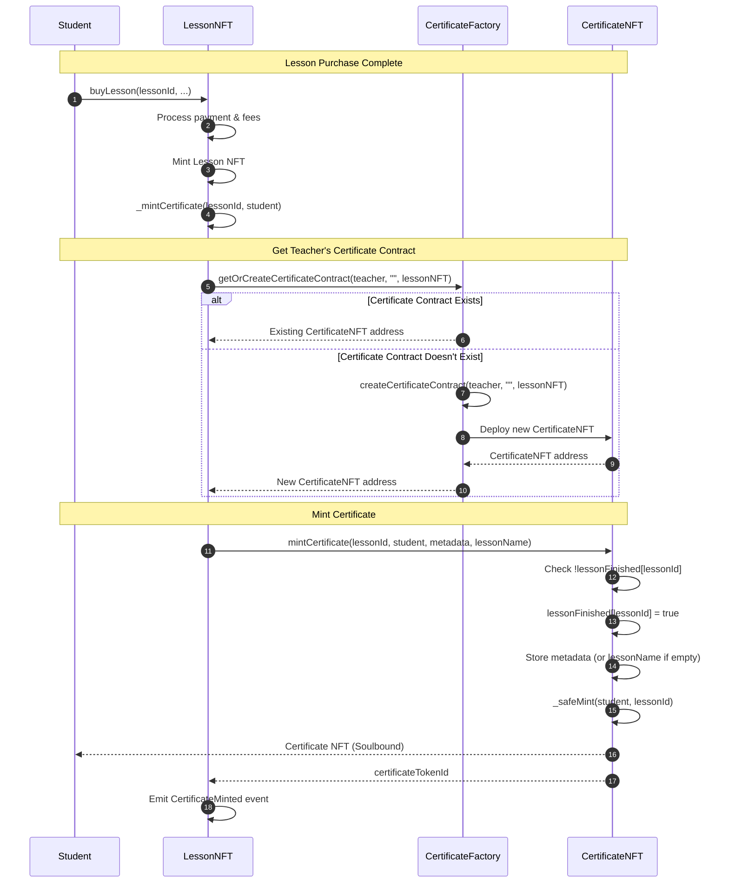
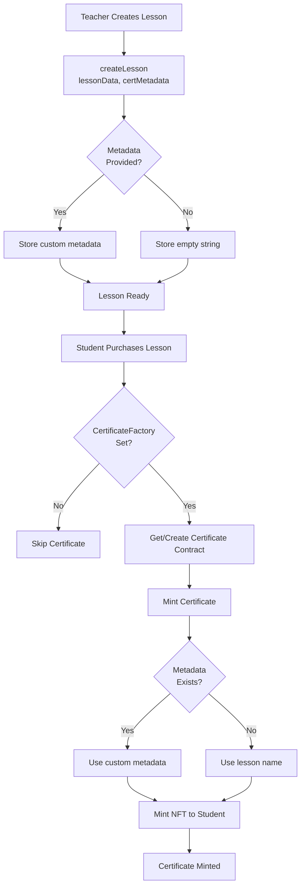

# Certificate System Architecture

## Overview

The certificate system provides verifiable on-chain credentials for course completion. Each teacher has their own CertificateNFT contract with custom metadata support.

## Architecture



## Flow: Certificate Minting



## Certificate Metadata

### Optional Metadata per Lesson

When creating a lesson, teachers can optionally provide certificate metadata:

```solidity
// In LessonNFT.createLesson()
function createLesson(
    bytes memory lessonData,
    string memory certMetadata  // Optional: empty string if not provided
) external onlyOwner returns (uint256 lessonId)
```

### Metadata Priority

1. **Custom Metadata**: If teacher provides `certMetadata` during lesson creation, it's used
2. **Lesson Name**: If no metadata provided, certificate uses the lesson name
3. **Base URI**: Teacher can set a base metadata URI in their CertificateNFT contract

### Storage

```solidity
// In LessonNFT
mapping(uint256 => string) public certificateMetadata; // lessonId => optional metadata

// In CertificateNFT
mapping(uint256 => string) public lessonMetadata; // lessonId => stored metadata
string public baseMetadataURI; // Teacher's base URI (optional)
```

## Certificate Contract Structure

### CertificateFactory

- **Purpose**: Creates CertificateNFT contracts per teacher
- **Functions**:
  - `createCertificateContract()`: Creates new CertificateNFT for teacher
  - `getOrCreateCertificateContract()`: Gets existing or creates new
  - `getTeacherCertificate()`: View function to get teacher's contract

### CertificateNFT (Per Teacher)

- **Purpose**: Soulbound ERC721 certificates for a specific teacher
- **Features**:
  - One-time mint per lesson (prevents duplicates)
  - Custom metadata per lesson (optional)
  - Soulbound (non-transferable)
  - Only LessonNFT can mint

### Key Properties

1. **Soulbound**: Certificates cannot be transferred
2. **One-Time Mint**: Each lesson can only mint one certificate
3. **Custom Metadata**: Teachers can provide custom metadata per lesson
4. **Automatic Minting**: Certificates are minted automatically after lesson purchase

## Integration Points

### LessonNFT Integration

```solidity
// After lesson purchase, automatically mint certificate
function buyLesson(...) external {
    // ... payment processing ...
    _safeMint(msg.sender, tokenId, data);
    _mintCertificate(lessonId, msg.sender); // Automatic certificate minting
}

function _mintCertificate(uint256 lessonId, address student) internal {
    if (certificateFactory == address(0)) return; // Skip if not set
    
    address certificateContract = ICertificateFactory(certificateFactory)
        .getOrCreateCertificateContract(onBehalf, "", address(this));
    
    string memory certMetadata = certificateMetadata[lessonId];
    string memory lessonName = _name;
    
    ICertificateNFT(certificateContract).mintCertificate(
        lessonId,
        student,
        certMetadata, // Custom metadata if provided
        lessonName    // Fallback to lesson name
    );
}
```

### LessonFactory Integration

```solidity
// LessonFactory constructor includes CertificateFactory
constructor(
    address _lessonNFTImplementation,
    address _treasuryContract,
    address _paymentToken,
    address _teacherNFT,
    address _certificateFactory  // Can be address(0) if not enabled
)
```

## Certificate Creation Flow



## Security Features

1. **Access Control**: Only LessonNFT can mint certificates
2. **One-Time Mint**: `lessonFinished` mapping prevents duplicate mints
3. **Soulbound**: Certificates cannot be transferred or approved
4. **Teacher Ownership**: Each teacher owns their CertificateNFT contract

## Events

```solidity
event CertificateContractCreated(
    address indexed teacher,
    address indexed certificateContract,
    string baseMetadataURI
);

event CertificateMinted(
    address indexed student,
    uint256 indexed lessonId,
    uint256 indexed tokenId,
    string metadata
);
```

## Benefits

1. **Verifiable Credentials**: On-chain proof of course completion
2. **Custom Branding**: Teachers can customize certificate metadata
3. **Automatic**: Certificates mint automatically after purchase
4. **Flexible**: Optional metadata allows teachers to choose level of customization
5. **Soulbound**: Prevents certificate trading, maintains authenticity

