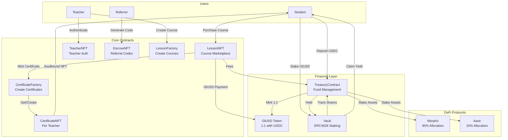
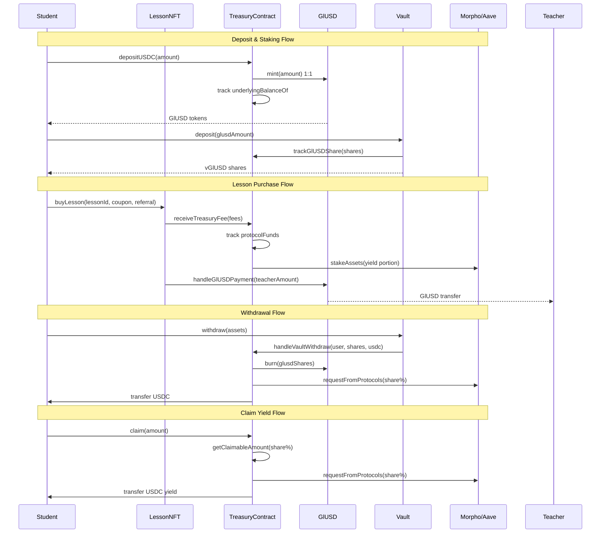
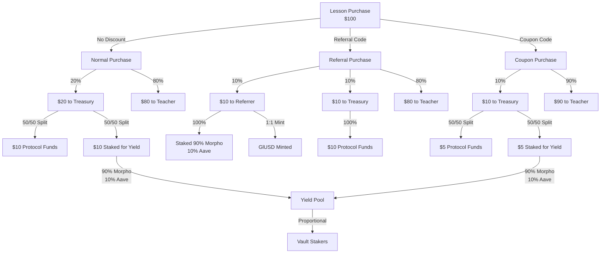
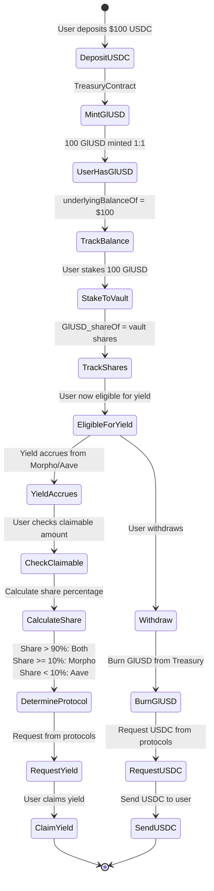
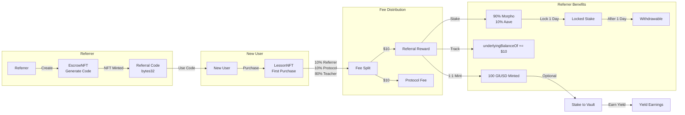
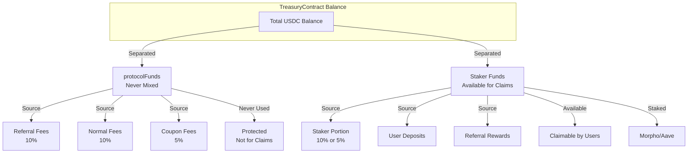
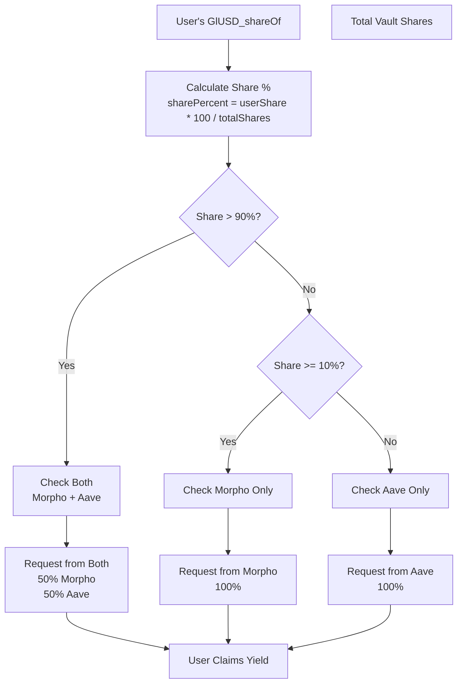
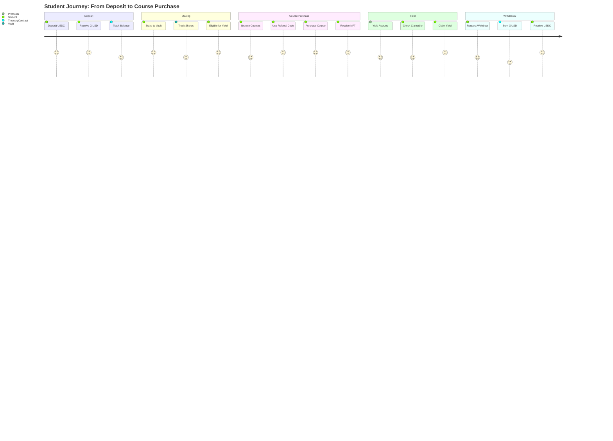
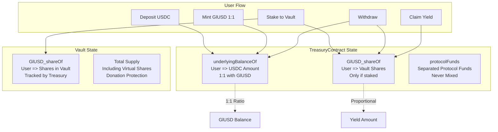
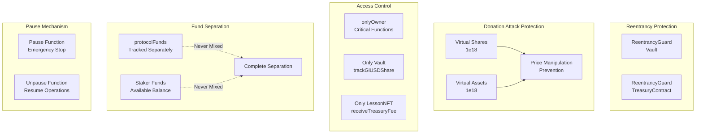

<<<<<<< HEAD
# Gnosisland System Architecture

## Overview Diagram

## Contract Interaction Flow

## Fee Distribution Flow

## Data Flow: User Deposit to Yield Claim

## Referral System Flow

## Protocol Funds Separation

## Share Percentage Logic

## Complete User Journey

## Contract State Tracking

## Security Features Diagram

=======
# System Architecture

## Overview

Gnosisland is a decentralized learning platform built on Base (Ethereum L2) that combines online education with DeFi yield generation. The system enables teachers to create and sell courses while students can purchase courses and earn yield on their deposits.

## Core Components

### 1. LessonNFT Contract
**Purpose**: Course marketplace and NFT minting for students

**Key Features**:
- Teachers create courses with minimum price of 25 USDC
- Students purchase courses with USDC or GlUSD
- Soulbound NFTs minted to students upon purchase
- Coupon code system (50% discount)
- Referral discount system (10% discount)
- Automatic certificate minting via CertificateFactory

**Storage**:
- `price`: Current course price
- `originalPrice`: Original price set by factory (immutable)
- `onBehalf`: Teacher's address
- `treasuryContract`: Treasury for fee distribution
- `paymentToken`: USDC address
- `teacherNFT`: Teacher authentication contract
- `certificateFactory`: Certificate creation contract

### 2. TreasuryContract
**Purpose**: Central fund manager and yield generator

**Key Features**:
- Receives 10% protocol fees from course purchases
- Mints GlUSD 1:1 with USDC deposits
- Stakes funds: 90% to Morpho Blue, 10% to Aave v3
- Manages protocol funds separately from staker funds
- Distributes yield to GlUSD holders
- Handles referral rewards (3% of purchase price)

**Storage**:
- `totalAssetsStaked`: Total USDC in DeFi protocols
- `morphoAssets`: USDC in Morpho (90%)
- `aaveAssets`: USDC in Aave (10%)
- `protocolFunds`: Protocol revenue (separate from staker funds)
- `underlyingBalanceOf`: User USDC deposits
- `userStakes`: Individual stakes with lock timestamps

**DeFi Integration**:
- **Aave v3 Pool**: `0xA238Dd80C259a72e81d7e4664a9801593F98d1c5`
- **Morpho Blue**: `0xBBBBBbbBBb9cC5e90e3b3Af64bdAF62C37EEFFCb`
- **USDC on Base**: `0x833589fCD6eDb6E08f4c7C32D4f71b54bdA02913`

### 3. Vault Contract (ERC4626)
**Purpose**: ERC4626-compatible vault for GlUSD staking

**Key Features**:
- Users deposit GlUSD to earn yield
- Protected against donation attacks via virtual shares
- Non-upgradeable for maximum security
- Tracks user shares for yield distribution
- On withdraw, GlUSD is burned from Treasury

**Storage**:
- `treasuryContract`: Reference to TreasuryContract
- `_virtualShares`: Virtual shares to prevent donation attacks
- `_virtualAssets`: Virtual assets to prevent donation attacks
- `GlUSD_shareOf`: User shares in vault

### 4. GlUSD Token
**Purpose**: Yield-bearing stablecoin representing vault shares

**Key Features**:
- 1:1 pegged with USDC initially
- Represents shares in the vault (ERC4626-style)
- Can appreciate with yield
- Users can redeem for at least their initial USDC
- Minted by TreasuryContract when users deposit USDC

### 5. TeacherNFT Contract
**Purpose**: Teacher authentication and verification

**Key Features**:
- Teachers must mint NFT to create courses
- Blacklist mechanism for banned teachers
- UUPS upgradeable pattern
- ERC7201 namespaced storage

### 6. CertificateFactory & CertificateNFT
**Purpose**: On-chain certificate system

**Key Features**:
- One CertificateNFT contract per teacher
- Soulbound NFTs (non-transferable)
- Minted automatically when student completes course
- Custom metadata per certificate

### 7. EscrowNFT Contract
**Purpose**: Referral code management

**Key Features**:
- Referral codes as NFTs
- Each code is a `bytes32` hash of `(tokenId, referrerAddress)`
- Allows delegation (referrer can be different from NFT owner)

### 8. LessonFactory Contract
**Purpose**: Factory for creating LessonNFT contracts

**Key Features**:
- Creates new LessonNFT instances for teachers
- Enforces minimum price (25 USDC)
- Sets up all required contract references

## System Flow

### Course Creation Flow
1. Teacher mints TeacherNFT
2. Teacher calls `LessonFactory.createLessonNFT()`
3. Factory deploys new LessonNFT contract
4. Teacher sets course price (minimum 25 USDC)
5. Course is available for purchase

### Course Purchase Flow
1. Student deposits USDC to TreasuryContract
2. TreasuryContract mints GlUSD 1:1 with USDC
3. Student can optionally stake GlUSD in Vault
4. Student calls `LessonNFT.buyLesson()` with:
   - Optional coupon code (50% discount)
   - Optional referral code (10% discount)
   - Payment amount
5. Fees are distributed:
   - 10% to protocol (TreasuryContract)
   - 10% to staker fund (if no referral)
   - 3% to referrer (if referral code used)
   - Remaining to teacher
6. Soulbound NFT minted to student
7. Certificate minted via CertificateFactory

### Yield Generation Flow
1. TreasuryContract receives fees (10% of purchases)
2. Fees are split:
   - 90% staked to Morpho Blue
   - 10% staked to Aave v3
3. Yield accrues over time (~6.25% APY average)
4. Users who staked GlUSD in Vault can claim yield
5. Yield increases the value of GlUSD shares

### Referral Flow
1. User creates referral code via EscrowNFT
2. Referral code is shared with potential students
3. Student uses referral code when purchasing
4. Referrer receives 3% of purchase price
5. Referral reward is automatically staked
6. Referrer earns yield on staked rewards

## Fee Structure

| Scenario | Protocol Fee | Staker Fee | Teacher Fee | Referrer Fee |
|----------|-------------|------------|-------------|--------------|
| **Normal Purchase** | 10% | 10% | 80% | - |
| **With Referral** | 10% | - | 80% | 10% |
| **With Coupon (50% off)** | 5% | 5% | 90% | - |

## Security Features

1. **Reentrancy Protection**: All critical functions use ReentrancyGuard
2. **Access Control**: Ownable pattern with role-based permissions
3. **Upgradeable Contracts**: UUPS pattern for safe upgrades
4. **Input Validation**: Comprehensive parameter checks
5. **Donation Attack Protection**: Vault uses virtual shares
6. **Fund Separation**: Protocol funds never mixed with staker funds
7. **Lock Period**: 1-day lock on staked funds

## Upgradeability

- **Upgradeable Contracts**: TreasuryContract, LessonNFT, TeacherNFT, DiscountBallot (UUPS pattern)
- **Non-Upgradeable Contracts**: Vault, GlUSD, CertificateNFT (maximum security)

## Storage Layout

All upgradeable contracts use ERC7201 namespaced storage to prevent storage collisions:
- `gnosisland.storage.TreasuryContract`
- `gnosisland.storage.LessonNFT`
- `gnosisland.storage.TeacherNFT`
- `gnosisland.storage.DiscountBallot`

## Network

- **Target Network**: Base Mainnet (Chain ID: 8453)
- **RPC URL**: `https://mainnet.base.org`
- **Native Token**: ETH
- **Payment Token**: USDC (Base)
>>>>>>> 435e828 (docs: recreate deleted documentation files)

