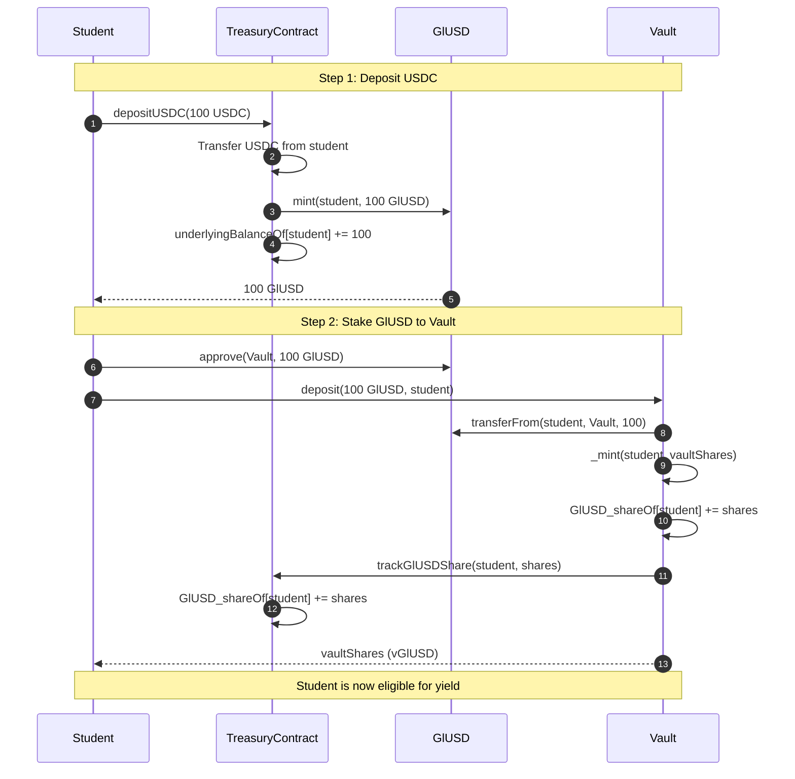
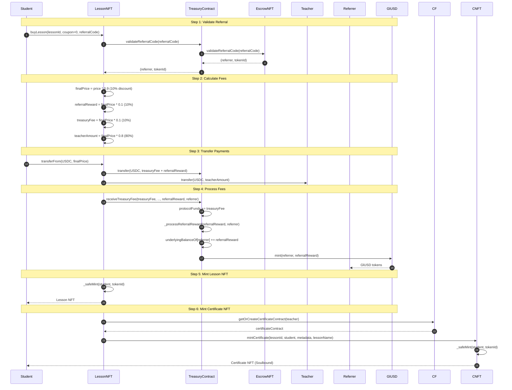
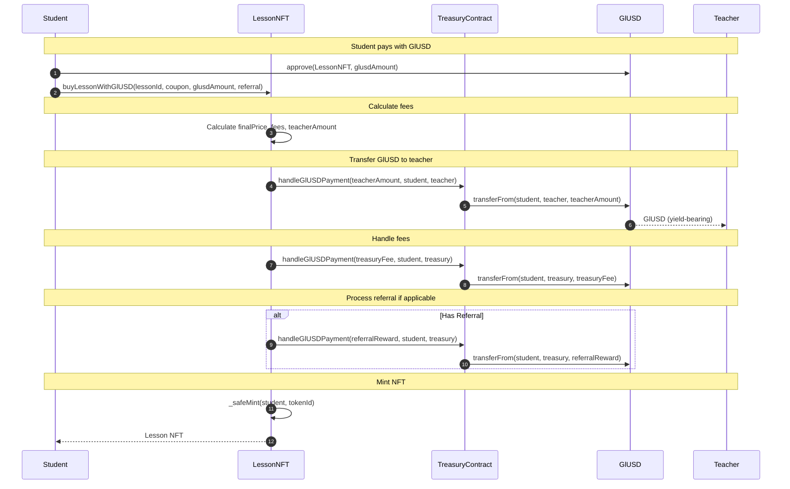
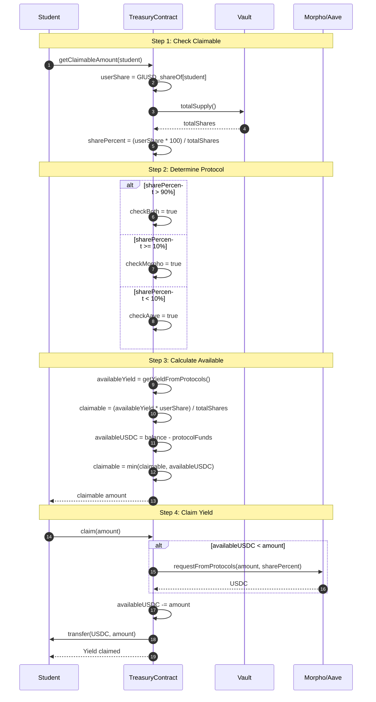
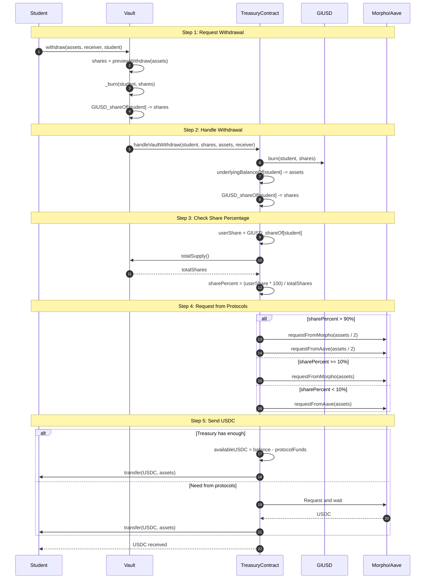
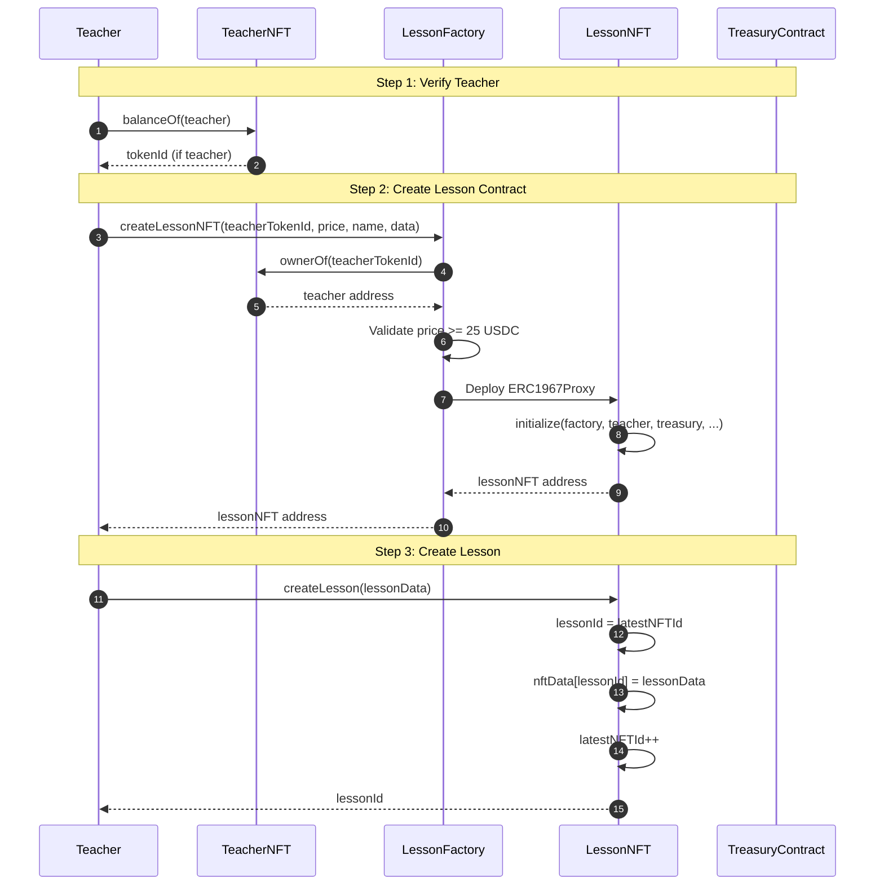
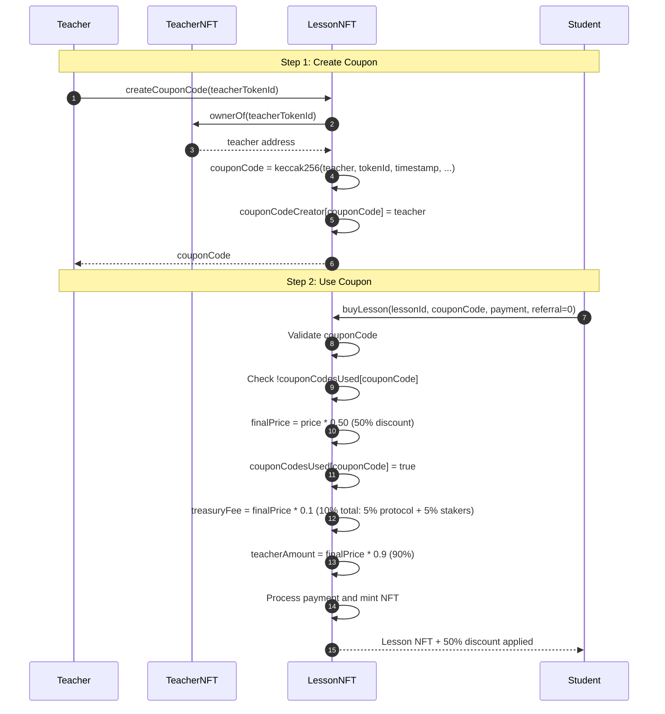
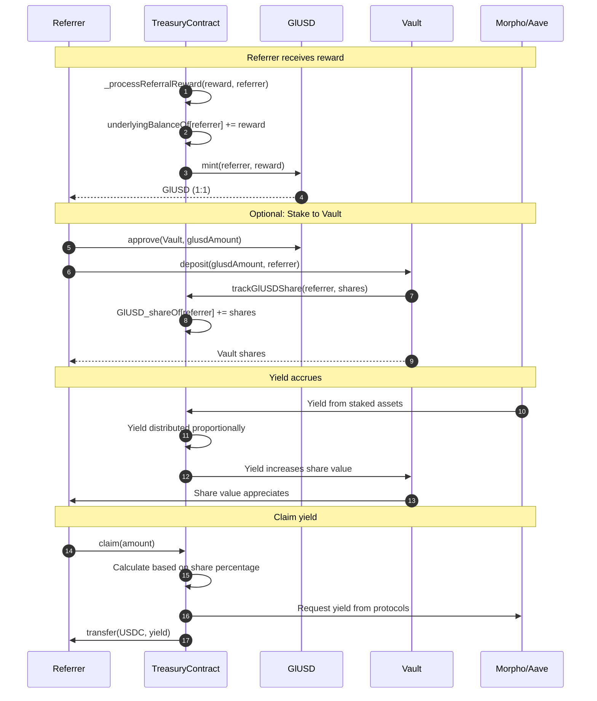

# Gnosisland User Flows

## Flow 1: Student Deposits and Stakes

## Flow 2: Lesson Purchase with Referral

## Flow 3: GlUSD Payment for Course

## Flow 4: Yield Claim Process

## Flow 5: Withdrawal Process

## Flow 6: Teacher Creates Course

## Flow 7: Coupon Code Creation and Usage

## Flow 8: Referral Reward Staking

